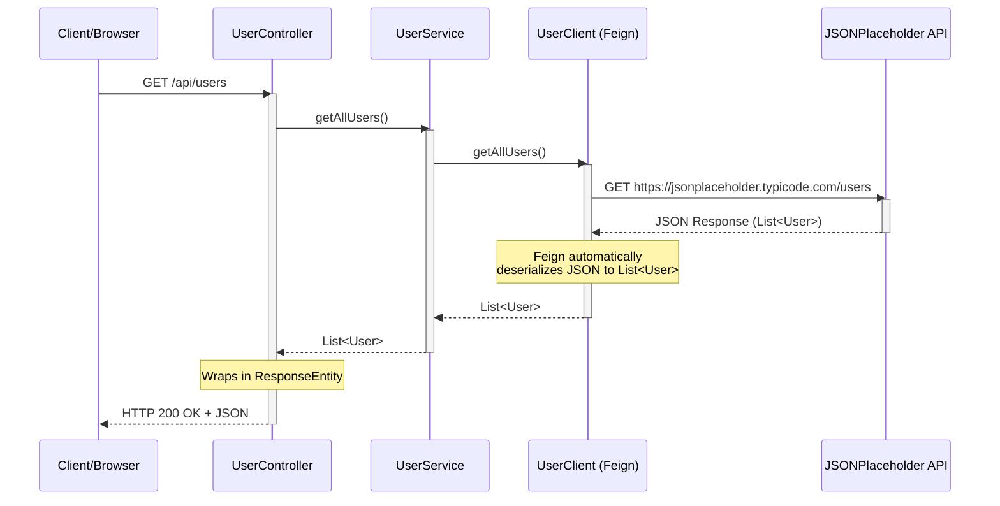

# Feign Client Learning Guide

## What is Feign?

Feign is a declarative HTTP client developed by Netflix. It makes writing HTTP clients easier by:
- **Declarative Syntax**: You define the API contract as an interface, not implementation
- **Automatic Serialization/Deserialization**: Converts Java objects to/from JSON automatically
- **Integration with Spring**: Works seamlessly with Spring Boot and Spring Cloud
- **Less Boilerplate**: No need to write HTTP client code manually

## Project Structure

```
src/main/java/com/example/springbootfeignclient/
├── Application.java              # Main class with @EnableFeignClients
├── model/
│   └── User.java                 # Data model/DTO
├── client/
│   └── UserClient.java           # Feign client interface
├── service/
│   └── UserService.java          # Service layer using Feign client
└── controller/
    └── UserController.java       # REST controller exposing endpoints
```

## How Feign Works

### 1. **Feign Client Interface** (`UserClient.java`)

```java
@FeignClient(name = "userClient", url = "https://jsonplaceholder.typicode.com")
public interface UserClient {
    @GetMapping("/users")
    List<User> getAllUsers();
}
```

**Key Points:**
- `@FeignClient`: Marks this as a Feign client
- `name`: Logical identifier for configuration
- `url`: Base URL of the external API
- Methods use Spring MVC annotations (`@GetMapping`, `@PostMapping`, etc.)
- Spring automatically creates the implementation at runtime

### 2. **Service Layer** (`UserService.java`)

```java
@Service
public class UserService {
    private final UserClient userClient;
    
    public List<User> getAllUsers() {
        return userClient.getAllUsers();
    }
}
```

**Why use a Service?**
- Encapsulates business logic
- Can add error handling, caching, retries
- Makes testing easier (can mock the service)
- Follows separation of concerns

### 3. **Controller** (`UserController.java`)

```java
@RestController
@RequestMapping("/api/users")
public class UserController {
    private final UserService userService;
    
    @GetMapping
    public ResponseEntity<List<User>> getAllUsers() {
        return ResponseEntity.ok(userService.getAllUsers());
    }
}
```

**Pattern:** Controller → Service → Feign Client → External API

## Request Flow Sequence Diagram

When a client calls `GET http://localhost:8080/api/users`, here's the complete flow:



### Step-by-Step Breakdown:

1. **Client Request**: Client sends `GET /api/users` to your Spring Boot application
2. **Controller**: `UserController.getAllUsers()` receives the request
3. **Service Call**: Controller calls `userService.getAllUsers()`
4. **Feign Client**: Service calls `userClient.getAllUsers()` (Feign interface method)
5. **HTTP Request**: Feign automatically makes HTTP GET request to `https://jsonplaceholder.typicode.com/users`
6. **External API**: JSONPlaceholder API processes the request and returns JSON array
7. **Deserialization**: Feign automatically converts JSON response to `List<User>` Java objects
8. **Response Chain**: Data flows back: Feign → Service → Controller
9. **HTTP Response**: Controller wraps data in `ResponseEntity` and returns JSON to client

### Key Points:
- **Automatic HTTP Handling**: You never write HTTP client code - Feign does it
- **Automatic JSON Conversion**: JSON is automatically converted to/from Java objects
- **Type Safety**: All method calls are type-checked at compile time
- **Transparent**: The service layer doesn't know it's calling an external API

## Advantages of Feign

1. **Declarative**: Define what you want, not how to do it
2. **Type-Safe**: Compile-time checking of method signatures
3. **Less Code**: No manual HTTP client setup
4. **Spring Integration**: Works with dependency injection, configuration, etc.
5. **Easy Testing**: Can mock Feign clients easily
6. **Automatic JSON Handling**: Jackson automatically serializes/deserializes

## Testing the Application

### 1. Start the application:
```bash
mvn spring-boot:run
```

### 2. Test the endpoints:

**Get all users:**
```bash
curl http://localhost:8080/api/users
```

**Get user by ID:**
```bash
curl http://localhost:8080/api/users/1
```

**Search users by name:**
```bash
curl "http://localhost:8080/api/users/search?name=Leanne"
```

## Common Feign Annotations

- `@FeignClient`: Marks interface as Feign client
- `@GetMapping`, `@PostMapping`, `@PutMapping`, `@DeleteMapping`: HTTP methods
- `@PathVariable`: Path variables (e.g., `/users/{id}`)
- `@RequestParam`: Query parameters (e.g., `?name=value`)
- `@RequestBody`: Request body for POST/PUT

## Configuration Options

You can configure Feign clients in `application.properties`:

```properties
# Connection timeout
feign.client.config.default.connectTimeout=5000
feign.client.config.default.readTimeout=10000

# Enable logging
logging.level.com.example.springbootfeignclient.client=DEBUG
```

## Next Steps to Learn

1. **Add Error Handling**: Create a custom error decoder
2. **Add Retry Logic**: Configure retries for failed requests
3. **Add Request/Response Interceptors**: Log requests/responses
4. **Multiple Feign Clients**: Create clients for different APIs
5. **Circuit Breaker**: Integrate with Resilience4j or Hystrix
6. **Authentication**: Add OAuth2 or API key authentication

## External API Used

This example uses [JSONPlaceholder](https://jsonplaceholder.typicode.com), a free fake REST API for testing and prototyping.

